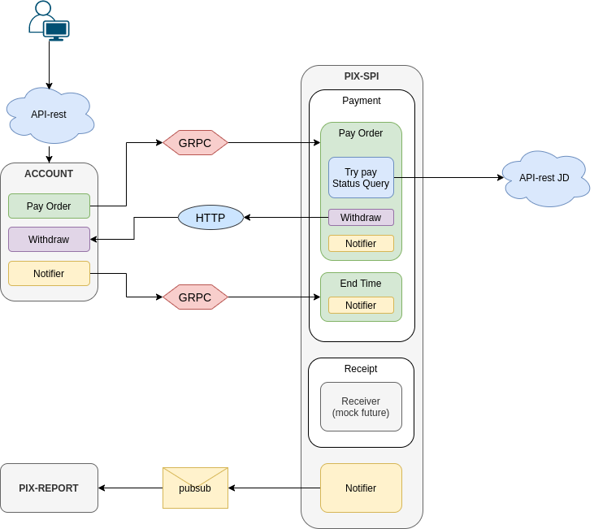
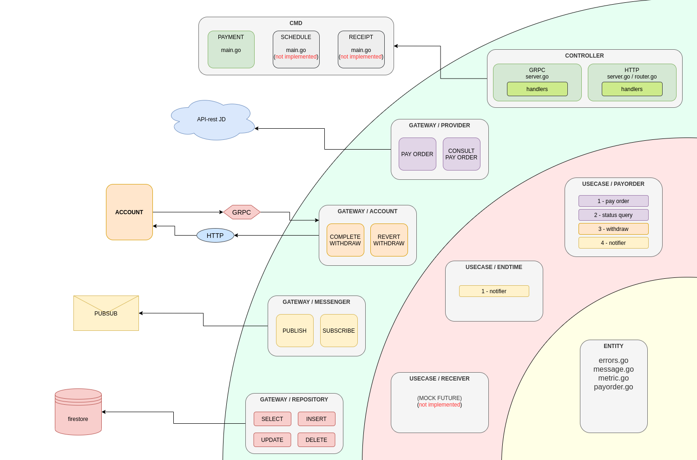

CARTESIAN - Tech challenge - April, 2021 
##### https://github.com/tobym/cartesian
==========================================

## Challenge Description
<p>Create an API server in go. It will deal with a series of points represented as (x,y) coordinates on a simple 2-dimensional plane.</p>

<p>Take a look at https://en.wikipedia.org/wiki/Cartesian_coordinate_system if you need a refresher on this concept.</p>

<p>It must have an api route at **/api/points** that accepts a **GET** request with the following parameters, and **returns a JSON list of points that are within distance from x,y, using the Manhattan distance method.** The points should be returned in **order of increasing distance from the search origin**.</p>

### Params
#### **x integer** (required). 
This represents the x coordinate of the search origin.
#### **y integer** (required). 
This represents the y coordinate of the search origin.
#### **distance integer** (required). 
This represents the Manhattan distance; points within distance from x and y are returned, points outside are filtered out.

*The Manhattan distance is measured "block-wise", as the distance in blocks between any two points in the plane (e.g. 2 blocks down and 3 blocks over for a total of 5 blocks).* It is defined as the sum of the horizontal and vertical distances between points on a grid. 

Formally, where p1 = (x1, y1) and p2 = (x2, y2), distance(p1,p2) = |x1-x2| + |y1-y2|.

**On startup, the API server should read a list of points from data/points.json.**

## Solution Description
### Prerequisites
What things you need to install the software and how to install them
#### Requires:
- Golang >= 1.14


### Development environment
#### Getting dependencies from external libraries
```bash
. ./configs/env.sh;
```

#### Compiling the binary for distribution
```bash
go build -o ./bin/cartesian ./cmd/cartesian
```
#### Running the source code tests
```bash
go test -v -cover -covermode=atomic ./...
```
#### Running the application
```bash
./bin/cartesian
```

### Internal structure

#### Overview

___________________________________________________________________________

#### Application
This application follows the standard of [Clean Architecture](https://blog.cleancoder.com/uncle-bob/2012/08/13/the-clean-architecture.html).

___________________________________________________________________________

#### Directory
The directory structure follows the [Standard Go Project Layout](https://github.com/golang-standards/project-layout).
```
.
├── cmd
│   └── cartesian
│       └── main.go
├── internal
│   ├── config
│   │   ├── config.go
│   │   └── domain.go
│   ├── controller
│   │   └── cartesian
│   │       ├── httpserver
│   │       │   ├── handler.go
│   │       │   ├── router.go
│   │       │   └── server.go
│   │       └── interactor.go
│   ├── entity
│   │   ├── errors.go
│   │   ├── message.go
│   │   ├── distance.go
│   │   └── distance_test.go
│   └── usecase
│       ├── gateway_bridge.go
│       └── cartesian
│           ├── domain.go
│           ├── domain_test.go
│           ├── interactor.go
│           ├── notifier.go
│           ├── distance.go
│           ├── distance_test.go
```
